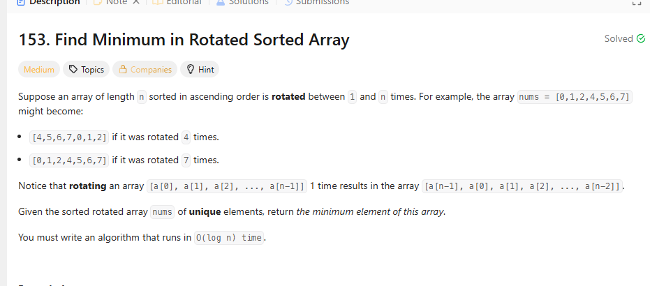

## 思路

1. 看单调性。

如果左边是单调减，那么我直接记录最小值，丢掉左边。

如果右边是单调减，那么我直接记录最小值，丢掉右边。

否则left++继续循环啊

```ts
export const findMin = (nums: number[]): number => {
  if (!nums?.length) return -1
  if (nums.length === 1) return nums[0]

  let left = 0
  let right = nums.length - 1

  let min = Infinity
  while (left < right) {
    const mid = Math.floor((left + right) / 2)
    //左边有序
    if (nums[left] <= nums[mid]) {
      min = Math.min(min, nums[left])
      left = mid + 1
    } else {
      min = Math.min(min, nums[mid])
      right = mid - 1
    }
  }

  return Math.min(min, nums[left])
}
```

2. 找旋转点
   那么请问怎么找呢？

正常情况是什么，nums[left] < nums[mid] < nums[right]

如果nums[mid] > nums[right]，那么说明旋转点右边，丢掉左边。

如果nums[mid] < nums[left]，那么说明旋转点在左边，丢掉右边。但是有问题，就是你用floor默认是左偏的，这是[0,1],[1,0]这种就直接失效了。而且也不是你+1可以解决的，要不然[1,0]这种，
你确实判断在左边了，但是right = mid,就死循环了。

```ts
export const findMin = (nums: number[]): number => {
  if (!nums?.length) return -1
  if (nums.length === 1) return nums[0]
  let left = 0
  let right = nums.length - 1
  while (left < right) {
    const mid = Math.floor((left + right) / 2)
    //旋转点在右边
    if (nums[mid] > nums[right]) {
      left = mid + 1
    } else {
      //旋转点在左边
      right = mid
    }
  }
  return nums[left]
}
```
