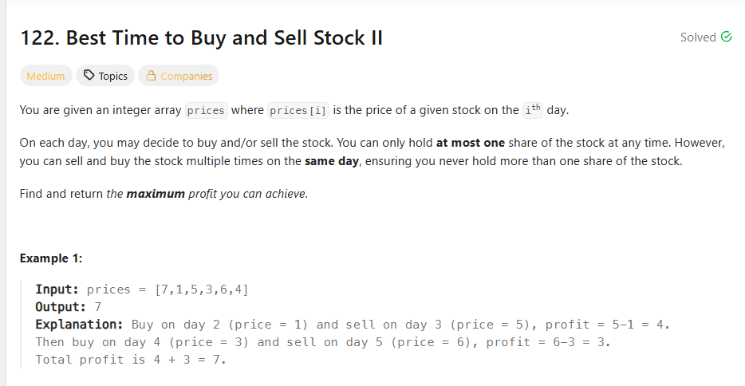

## 思路

其实你要知道什么是赚钱，其实这是典型的dy问题。

1. 找递增区间，即dy>0

业务飞速，两个指针，找到最大的增量，然后加起来即可。其实不管增加多少，只有dy>0就还是在涨

```ts
function maxProfit(prices: number[]): number {
  let profit = 0
  let left = 0
  let right = 1
  while (right < prices.length) {
    //减少了卖掉
    if (deltY(prices[left], prices[right]) <= 0) {
      profit += Math.max(prices[right - 1] - prices[left], 0)
      left = right
    }
    right++
  }
  //补上最后一段
  profit += Math.max(prices[prices.length - 1] - prices[left], 0)
  return profit
}

const deltY = (y1: number, y2: number) => y2 - y1
```

但是还是是那句话，你只是要算profit,你其实要不要算出这个递增区间，这可能也是一种多余吧

2. 吃掉所有收益，你每天都卖出，短期的最大收益，拼起来就是整个区间的最大收益

```ts
function maxProfit(prices: number[]): number {
  let profit = 0
  for (let i = 1; i < prices.length; i++) {
    if (prices[i] > prices[i - 1]) {
      profit += prices[i] - prices[i - 1]
    }
  }
  return profit
}
```
