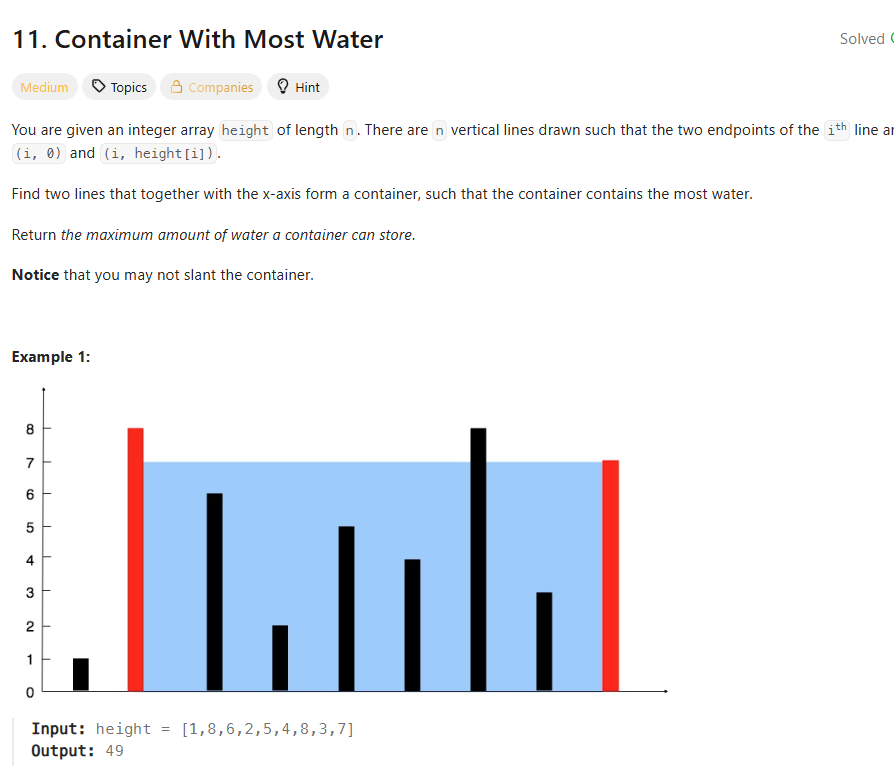

## 思路

1. 枚举（计算出所有的面积）

其实我感觉你肯定能写出来，O(n(n-1))

```ts
const maxArea = function (height: number[]) {
  let res = 0
  for (let i = 0; i < height.length; i++) {
    for (let j = i + 1; j < height.length; j++) {
      const area = computeArea(height, i, j)
      res = Math.max(res, area)
    }
  }
  return res
}

const computeArea = (height: number[], i: number, j: number) => {
  return Math.min(height[i], height[j]) * (j - i)
}
```

但是还是那句话，能算出来，和要不要算出来是两码事

2. 贪心

你想要贪最多的w\*h,肯定是想要w,h都最高。其实w就是index,这边其实几乎不要管，你也控制不了。

那么h呢，你是不是要贪最高的那个，然后index呢，是不是要贪最远的那个。

也就是说，**你用两个指针，一个指向最左，一个指向最右，然后每次都贪最高的那个，然后移动最短的边。这样就能保证你每次移动都是最优解**。

复杂度也直接降到了O(n)

```ts
const maxArea = function (height: number[]) {}

const recurse = (height: number[], left: number = 0, right: number = height.length - 1, max: number = 0) => {
  if (left >= right) return max
  const area = computeArea(height, left, right)
  //保留大的即可
  if (height[left] < height[right]) {
    return recurse(height, left + 1, right, Math.max(max, area))
  } else {
    return recurse(height, left, right - 1, Math.max(max, area))
  }
}
```
