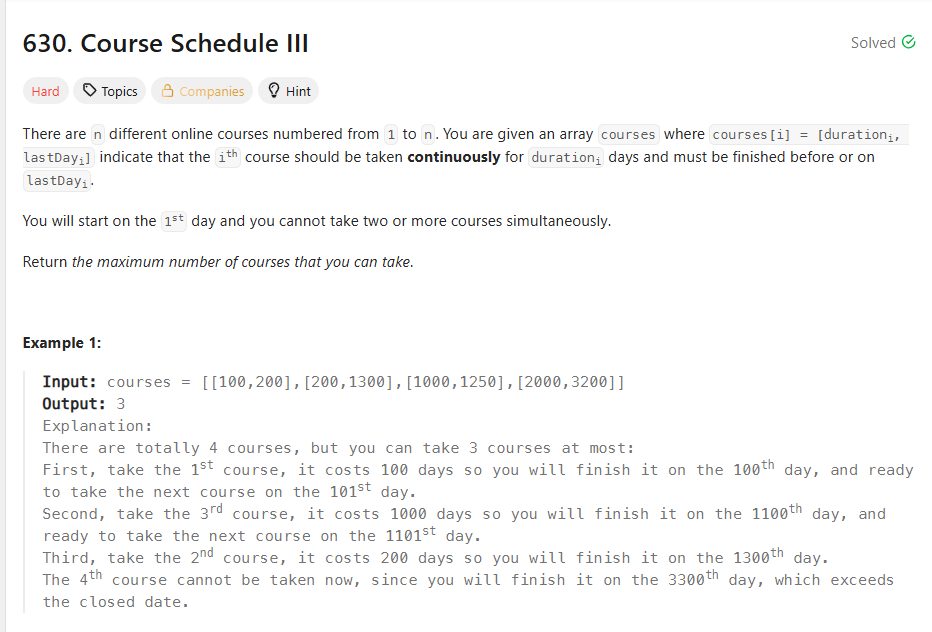

## 思路

很典型的贪心，想要在规定时间内，完成更多的课程。就是要贪结束时间最早的，和之前那个不重复区间其实是一模一样的。
但是有不同的地方，这不是区间，不是开始时间。然后你就炸了。

那么怎么去找最大耗时的课程，这个和贪心无关，方法也很多。但是选什么。

你肯定不能选冒泡那种东西的，O(n^2)。

而且你只要最大值，其他的值的顺序，其实你也不关心。

这里就出现了数组的一个特性了。数组他不仅仅是数组。他还可以表示完全二叉树。以index为n的节点为root,那么他的两个child则是分别是2n+1和2n+2。

没错就是你想的那个，heap. React那边是最小堆，只是我们要用最大堆罢了。我们只管根节点和子节点的大小关系，子树之间我们是不管的。

你想影响len=n 的数组，搞成完全二叉树之后，也就是 2^x = n,取log之后，就是x=logn，你想想那个图形，肯定是logn的复杂度低。

而且其中有一半是子节点，不要要操作。一次操作，最复杂的sinkdown也只是logn，其他的约接近的子节点的移动越少，所以他的复杂度远远小于o(nlogn)

复杂的推导就算了，毕竟高数我也忘了差不多了，你可以记住其实构建一个heap的复杂度也就是O(n)的。
