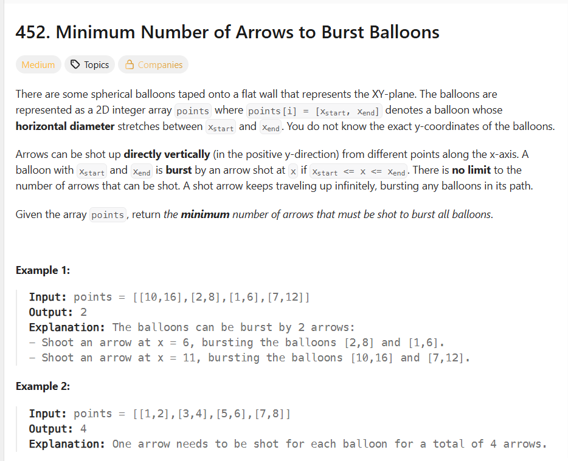

## 思路

这题其实也是思路清奇，之前都是问，怎么找不重复的区间。然后按结束排序，然后贪最早结束的。

但是这题是arrow是可以引爆xstart <= x <= xend的气球的，我想要用最少的arrow,肯定要找出来相交的区间才行。这个正好和上面反过来。

# 二分法

其实你也能够看出来，arrow的范围是[1,array.length],这东西也是有序的，用二分法是完全没有问题的！

然后复杂度就O(nlogn),你要想有没有必要？

# 贪心

你要明确一件事，我们不是求那些是相交的区间，我们是求的arrow的数量。那么如果是你，你怎么要去射才是最优解？

首先还是要排序，按结束排序。
然后你在最后的位置shoot.

为啥呢？因为你这个气球想被射爆的话，必须得在xend之前，所以你肯定要尽可能的往后射，这样你才能保证尽可能多的气球被射爆。
