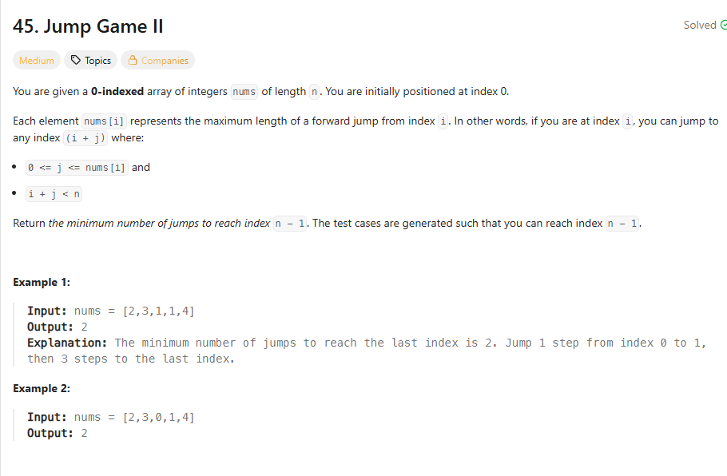

## 思路

1. 枚举所有可能性

但这显然不是最优解，然后复杂度为O(n^n)

2. 贪心

我不想知道具体你走怎么跳的，我也不知道最优解，也不想知道在哪里跳.但是你要知道哪里你不得不跳，也就是说不可达的时候，你就要跳到最远的地方。

```ts
let reachable = Math.max(reachable, index + nums[index])
/**这里必须有等于，否则如果下一个index要是更新reachable,会少跳一次，比如说[1,1,1,1] */
if (index >= currentReachable) {
  currentReachable = reachable
  step++
}
```
