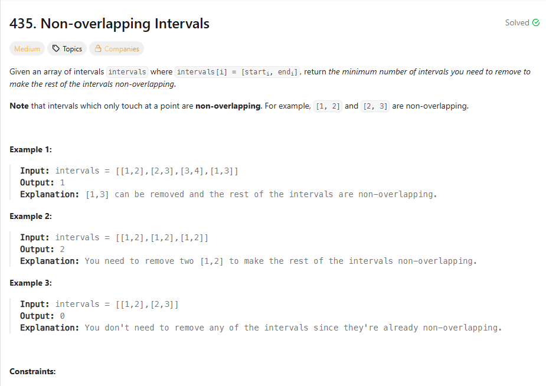

## 思路

1. 排序保留小区间

先按照a[0]从小到大排，再按照a[1]从小到大排，这样的话，你重叠直接删除后面一个区间

```ts
//先按照a[0]从小到大排，再按照a[1]从小到大排
intervals.sort((a, b) => {
  if (a[0] !== b[0]) {
    return a[0] - b[0]
  }
  return a[1] - b[1]
})

let left = 0
let res = 0
for (let right = 1; right < intervals.length; right++) {
  const leftNode = intervals[left]
  const rightNode = intervals[right]
  //相交直接删除右边的
  if (leftNode[1] > rightNode[0]) {
    res++
  } else {
    //那么left移到right
    left = right
  }
}
```

但是这个方法的问题在于，其实你已经求出来了所有要删除的区间细节，但其实这个是没有必要的，这也算是一种变相枚举了

2. 贪心

我不知道怎么删除，但是我每次都保留最早结束的，那么我就可以留下更多区间了。也就是我要贪最小的结束区间

```ts
intervals.sort((a, b) => {
  if (a[0] !== b[0]) {
    return a[0] - b[0]
  }
  return a[1] - b[1]
})

let left = 0
let res = 0
for (let right = 1; right < intervals.length; right++) {
  const leftNode = intervals[left]
  const rightNode = intervals[right]
  //相交直接删除右边的
  if (leftNode[1] > rightNode[0]) {
    res++
  } else {
    //那么left移到right
    left = right
  }
}
```

其实你会想这种情况

[1,5]
[4,5]
按理来说，你是不是要删[1,5]来保留更多的区间

但是实际情况是

[1,5]
[1,2] [2,5]
的话，你排序之后
[1,2]
[1,5]
[2,5]
这样的话，并不会存在[1,5]再前面导致删不掉的情况,而且我也不关心[1,5]和[2,5]谁在前
