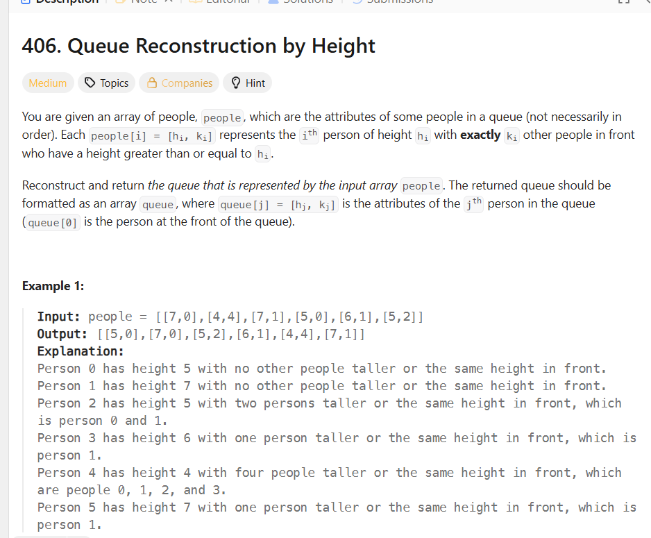

## 思路

你想应该怎么排`[hj, kj]`这东西。

其实我的一开始反应，这东西是不是区间呢，如果我按`kj`这东西从小往大排，反正最小的那个h的的人，肯定是排在最前面，
然后，构建一个新的队列，然后每次进来你都要调整一下。当然这样肯定是没有问题的每次调整都是O(n^2)的，因为你入队之后全体都要重排。整体直接搞到了O(n^3)。
这就太可怕了。

那么有没有其他方法？

其实这就是贪心的另一种类型了，除了区间那种，就是手动构建贪心条件，其实很可达性是一个道理。你每次都要更新可达性，这东西本质上就是构建最简单的一种贪心。

那种假如队列里面都是比自己高的人，那么你就可以直接插入，直接局部到全局。
