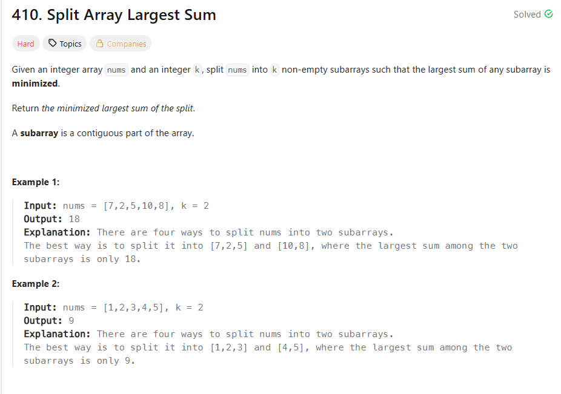

## 思路

不愧是hard,看上去就是一脸懵逼。
而且，例子都是k=2,两端其实还好，我可以直接放头尾两个指针，哪边小就移动哪边，然后相交就找到了最平衡的最小的最大值。

但是，k>=2,你怎么知道怎么split?

1. 是否可以排序。

其实排序是一个很经典的想法，有序去逼近，不就是二分法的精髓。
当然，这里的排序，可以的去找**leftSum\*(k-1) <= rightSum**。
但是，这里要顺序的，连续切。很明显这可以pass了。

2. 是否准确的Sum最小值

假如说，如果我猜一个最小是Sum = X,那么我直接切出了K段，不就行了。
其实可不可以切就是最典型的贪心，比如说那种找硬币什么的。

但是这个X是什么，我不知道啊，我在想不可能是平均数什么的吧？
这也显然不可能，你很马云平均一下也是亿万富翁有什么用呢？

很显然，这是没有准确的X.

3. 虽然Sum没有准确的值，但是有范围

我以为是山重水复疑无路，但是去AI那里交流一下。我猜发现，原来没有准确的值，但是有范围。
范围很简单，就是**[max(nums),sum(nums)]**。

等一下啊，范围有了，这个范围就是有序的，然后去逼近，这不就是二分法吗？

```ts
let left = Math.max(...nums)
let right = nums.reduce((a, b) => a + b, 0)

//二分法就是套路了
while (left < right) {
  //首先注意，floor是向下取整，后默认左偏
  const mid = Math.floor((left + right) / 2)
  if (canSplit(nums, k, mid)) {
    //保留right是不会卡住的(因为会左边)
    right = mid
  } else {
    //因为左偏，所以左边跨是没有问题的
    left = mid + 1
  }
}
//其实退出条件本来就是left === right,你返回right其实也可以
return left
```
