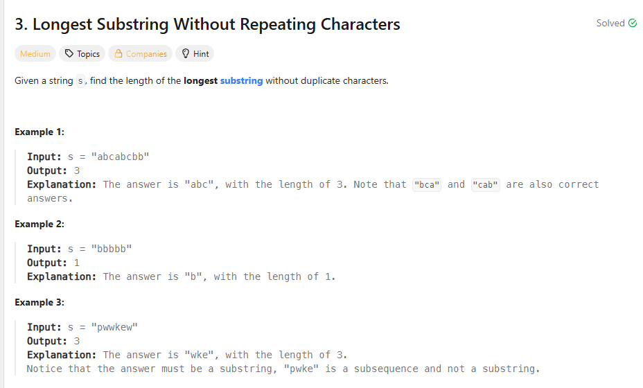

## 思路

典型的滑动窗口

```ts
let let = 0,
  right = 0,
  length = -infinity

let seen = new Set()
while (right < s.length) {
  if (seen.has(s[right])) {
    //如果包含，怎么办
    //我第一反应其实是直接把left移到当前right,但是这样是不对的
    //正确的做法是移到重复字符的下一个位置
    maxLen = Math.max(maxLen, right - left)
    seen.delete(s[left])
    left++
  } else {
    right++
    seen.add(s[right])
  }
}
length = Math.max(length, right - left + 1)
```
